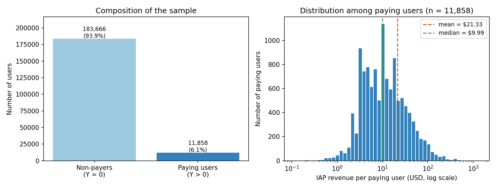
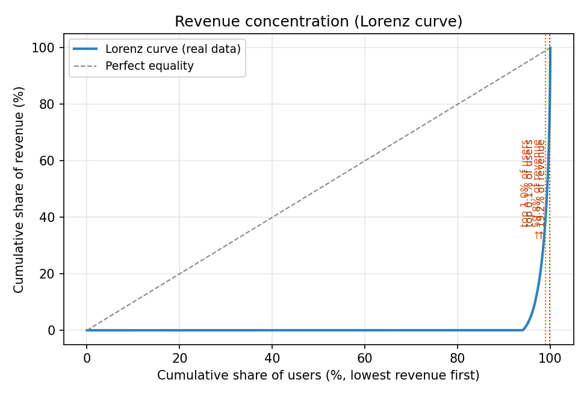
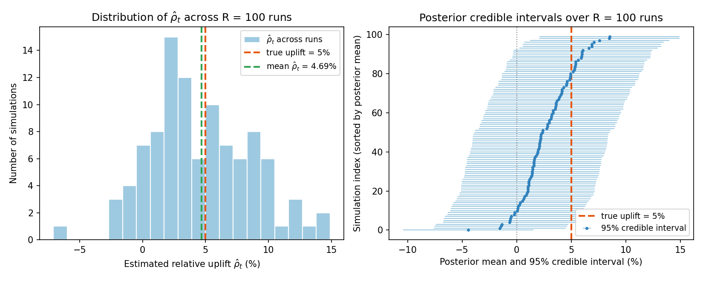

# Statistical Methodology for In-House A/B Testing

*Narrative Methods Description (Game Live-Ops Context)*

## 1. Purpose and scope

A core part of live operations at a game studio is designing and running
controlled experiments — the simplest form being A/B tests — to optimize
online products. With dozens of experiments run each year, a coherent,
auditable statistical story matters for both product decisions and long-term
learning. This note describes how user-level data flow into summaries, how
variance reduction and relative effects are defined, how Bayesian inference
sits on top of those summaries, and where frequentist diagnostics and known
limitations fit. The goal is a single narrative rather than a list of
disconnected formulas.

## 2. Notation

Symbols are introduced once here and reused throughout. We distinguish
*population* quantities (unobserved, no hat) from *sample-based estimators*
(hat or bar).

| Symbol | Meaning |
|---|---|
| $g$ | Assignment group index; $g \in \{C, 1, 2, \dots, K-1\}$, with $C$ the control group and $t \in \{1, \dots, K-1\}$ the $t$-th treatment variant. |
| $K$ | Number of groups (control + treatment variants). |
| $i \mapsto g$ | "User $i$ is assigned to group $g$" (reads as "$i$ maps to $g$"). |
| $Y_{i,g}$ | User-level outcome (KPI) for user $i$ in group $g$, after KPI-specific filters. |
| $\mathbf{x}_i$ | Vector of pre-experiment covariates for user $i$ (e.g. pre-period spend, sessions, tenure), with missingness indicators appended. |
| $n_g$ | Number of users in group $g$ with a non-null outcome. |
| $\mu_g$ | Population mean of $Y$ in group $g$, i.e. $\mathbb{E}[Y_{i,g}]$. Estimated by $\hat\mu_g$. |
| $\bar Y_g$ | Sample mean of $Y$ in group $g$ (an estimator of $\mu_g$). |
| $s_g$ | Sample standard deviation of $Y$ in group $g$. |
| $\widehat{\mathrm{SE}}(\bar Y_g)$ | Estimated standard error of $\bar Y_g$. |
| $\Delta_t$ | Population absolute treatment effect of variant $t$ vs. control: $\Delta_t = \mu_t - \mu_C$. |
| $\hat\Delta_t$ | Estimator of $\Delta_t$: $\hat\Delta_t = \bar Y_t - \bar Y_C$. |
| $\mu_C^{\text{raw}}$ | Control-group population mean on the *raw* (non-CUPED) KPI. Estimated by $\bar Y_C^{\text{raw}}$. |
| $\rho_t$ | Population relative treatment effect, $\rho_t = \Delta_t / \mu_C^{\text{raw}}$. This is also the latent parameter updated in the Bayesian step (Section 6); no separate symbol is used. |
| $\hat\rho_t$ | Sample estimator of $\rho_t$: $\hat\rho_t = \hat\Delta_t / \bar Y_C^{\text{raw}}$. Treated in the Bayesian step as a noisy measurement of $\rho_t$. |
| $\hat\sigma_{\text{obs},t}$ | Estimated standard error of $\hat\rho_t$ from the delta method. |
| $\mu_0,\ \sigma_0^2$ | Prior mean and variance for $\rho_t$. |
| $\mu_{\text{post},t},\ \sigma_{\text{post},t}^2$ | Posterior mean and variance of $\rho_t$ given data. |
| $\tau_0,\ \tau_{\text{data},t},\ \tau_{\text{post},t}$ | Precisions: $\tau_0 = 1/\sigma_0^2$, $\tau_{\text{data},t} = 1/\hat\sigma_{\text{obs},t}^2$, $\tau_{\text{post},t} = \tau_0 + \tau_{\text{data},t}$. |
| $\Phi(\cdot)$ | CDF of the standard normal $\mathcal{N}(0,1)$ distribution. |

## 3. From randomization to group-level summaries

### 3.1 Variants, control, and estimands

Users are assigned to a control group and one or more treatment variants
indexed by $t \in \{1, \dots, K-1\}$ (non-control test groups). For a fixed
key performance indicator (KPI), the outcome $Y_{i,g}$ is observed for each
user in the analysis window. Under standard assumptions — stable unit
treatment values and no interference between users — contrasts $\mu_t - \mu_C$
identify the average treatment effect of variant $t$ on the user-level
outcome. The estimand of primary interest is the *relative* version
(for $\mu_C^{\text{raw}} \neq 0$) defined in Section 4.2.

### 3.2 Means and standard errors at the group level

After preprocessing, analysis works with aggregates by assignment group.
Let $\mathcal{I}_g = \{ i : i \mapsto g \}$ be the index set of users
assigned to group $g$. Then

$$
\hat\mu_g \;=\; \bar Y_g \;=\; \frac{1}{n_g} \sum_{i \in \mathcal{I}_g} Y_i ,
\tag{1}
$$

$$
s_g^2 \;=\; \frac{1}{n_g - 1} \sum_{i \in \mathcal{I}_g} \bigl( Y_i - \bar Y_g \bigr)^2 ,
\tag{2}
$$

$$
\widehat{\mathrm{SE}}\bigl(\bar Y_g\bigr) \;=\; \frac{s_g}{\sqrt{n_g}} .
\tag{3}
$$

Each assignment group contributes a pair $\bigl(\bar Y_g,\ \widehat{\mathrm{SE}}(\bar Y_g)\bigr)$
that summarizes the evidence for that variant or the control.

## 4. Absolute and relative treatment effects

### 4.1 Absolute uplift

For each treatment variant $t \in \{1, \dots, K-1\}$, the absolute uplift
estimator is

$$
\hat\Delta_t \;=\; \bar Y_t - \bar Y_C .
\tag{4}
$$

Randomization makes $\bar Y_t$ and $\bar Y_C$ approximately independent
(conditional on the realized sample sizes $n_t, n_C$), so

$$
\widehat{\mathrm{SE}}\bigl(\hat\Delta_t\bigr)
\;=\; \sqrt{ \widehat{\mathrm{SE}}(\bar Y_t)^2 + \widehat{\mathrm{SE}}(\bar Y_C)^2 } .
\tag{5}
$$

Equations (4)–(5) support standard large-sample normal reporting for
$\hat\Delta_t$ and feed the relative-uplift step.

### 4.2 Relative uplift and a consistent denominator

Stakeholders typically interpret results as percentage change relative to
control. Two conventions matter here. First, the denominator is *always*
the control mean on the **raw** (non-CUPED) KPI, $\bar Y_C^{\text{raw}}$,
even when the numerator $\hat\Delta_t$ uses a CUPED-adjusted outcome
(Section 5). Second, only the numerator carries the variance-reduction
benefit; the business denominator is fixed to the raw baseline so that
"% lift" is interpretable on a single scale across experiments. The
relative uplift estimator is

$$
\hat\rho_t \;=\; \frac{\hat\Delta_t}{\bar Y_C^{\text{raw}}} .
\tag{6}
$$

### 4.3 Uncertainty for ratios via the delta method

The relative uplift is a nonlinear function of two estimated means.
Write $\hat\rho_t = f\bigl(\hat\Delta_t, \bar Y_C^{\text{raw}}\bigr)$ with
$f(a, b) = a/b$. A first-order Taylor expansion of $f$ around the
population values $(\Delta_t, \mu_C^{\text{raw}})$ gives

$$
\hat\rho_t \;\approx\; \frac{\Delta_t}{\mu_C^{\text{raw}}}
\;+\; \frac{1}{\mu_C^{\text{raw}}}\bigl(\hat\Delta_t - \Delta_t\bigr)
\;-\; \frac{\Delta_t}{\bigl(\mu_C^{\text{raw}}\bigr)^2}\bigl(\bar Y_C^{\text{raw}} - \mu_C^{\text{raw}}\bigr) ,
\tag{7}
$$

so the coefficients in the delta-method variance are exactly the two
partial derivatives of the ratio function. Assuming $\hat\Delta_t$ and
$\bar Y_C^{\text{raw}}$ are approximately independent (a standard working
assumption under randomization),

$$
\widehat{\mathrm{Var}}\bigl(\hat\rho_t\bigr)
\;\approx\;
\left( \frac{1}{\bar Y_C^{\text{raw}}} \right)^{\!2}
\widehat{\mathrm{Var}}\bigl(\hat\Delta_t\bigr)
\;+\;
\left( \frac{\hat\Delta_t}{\bigl(\bar Y_C^{\text{raw}}\bigr)^2} \right)^{\!2}
\widehat{\mathrm{Var}}\bigl(\bar Y_C^{\text{raw}}\bigr) ,
\tag{8}
$$

where $\widehat{\mathrm{Var}}(\hat\Delta_t) = \widehat{\mathrm{SE}}(\hat\Delta_t)^2$
and $\widehat{\mathrm{Var}}(\bar Y_C^{\text{raw}}) = \widehat{\mathrm{SE}}(\bar Y_C^{\text{raw}})^2$.
We report

$$
\hat\sigma_{\text{obs},t} \;=\; \sqrt{\widehat{\mathrm{Var}}\bigl(\hat\rho_t\bigr)} .
\tag{9}
$$

The same gradient logic extends to KPIs defined as ratios of two per-user
metrics and to compound relative uplifts built from numerator and
denominator KPIs, yielding a single scalar $\hat\sigma_{\text{obs},t}$ in
each case.

## 5. CUPED as a variance-reduction layer before inference

Outcomes in games are often predictable from pre-experiment engagement or
spend. **Controlled-experiment Using Pre-Experiment Data (CUPED)** exploits
this by regressing the in-period outcome on pre-period covariates (with
missingness indicators) at the user level,

$$
Y_i \;=\; \beta_0 + \mathbf{x}_i^\top \boldsymbol\beta + \varepsilon_i ,
\tag{10}
$$

where:

- $\beta_0$ is the intercept (the expected outcome for a user whose
  covariates are all at the reference level / zero).
- $\boldsymbol\beta$ is the vector of covariate slopes; $\beta_j$ is the
  expected change in $Y_i$ per unit change in the $j$-th pre-experiment
  covariate, holding the others fixed.
- $\mathbf{x}_i$ is the pre-experiment covariate vector for user $i$;
  each component is observed *before* randomization and therefore cannot
  have been affected by treatment.
- $\varepsilon_i$ is the residual noise (what the covariates cannot
  explain), assumed to have zero conditional mean.

Ordinary least squares produces estimates $\hat\beta_0$ and
$\hat{\boldsymbol\beta}$, and the fitted value for user $i$ is

$$
\hat Y_i \;=\; \hat\beta_0 + \mathbf{x}_i^\top \hat{\boldsymbol\beta} .
\tag{11}
$$

Intuitively, $\hat Y_i$ is the "best guess" of user $i$'s in-period outcome
made using only pre-experiment information. CUPED then replaces the raw
outcome by the residual — the part of $Y_i$ that the pre-period covariates
could not predict —

$$
Y_i^{\text{CUPED}} \;=\; Y_i - \hat Y_i .
\tag{12}
$$

Because $\hat Y_i$ is constructed from pre-randomization variables,
subtracting it removes noise without distorting the treatment effect; in
expectation, $\mathbb{E}[Y_t^{\text{CUPED}} - Y_C^{\text{CUPED}}] = \Delta_t$.
Group means and standard errors (1)–(3) are then recomputed with
$Y_i^{\text{CUPED}}$ in place of $Y_i$, yielding smaller $s_g$ and hence
smaller $\widehat{\mathrm{SE}}(\bar Y_g)$. Only after this step does the
pipeline form $\hat\Delta_t$, $\hat\rho_t$, and $\hat\sigma_{\text{obs},t}$:
variance reduction is part of the measurement model, not an afterthought.

## 6. Bayesian inference on relative uplift

### 6.1 Normal–normal conjugate update

The parameter we want to learn in this step is the same $\rho_t$ introduced
in Section 4 — the population relative treatment effect of variant $t$ vs.
control. Its sample estimator $\hat\rho_t$, with standard error
$\hat\sigma_{\text{obs},t}$ from (9), is treated as a noisy measurement of
this unknown $\rho_t$. We do *not* introduce a separate Greek letter (such
as $\theta$) for the latent parameter; the population vs. estimator
distinction is carried entirely by the hat, so $\rho_t$ is what we want to
know and $\hat\rho_t$ is what the data tell us. The prior–likelihood pair
is:

$$
\rho_t \;\sim\; \mathcal{N}\!\bigl(\mu_0,\ \sigma_0^2\bigr) ,
\qquad
\hat\rho_t \,\big|\, \rho_t \;\sim\; \mathcal{N}\!\bigl(\rho_t,\ \hat\sigma_{\text{obs},t}^2\bigr) .
\tag{13}
$$

The normal prior and normal sampling model are conjugate. With precisions
$\tau_0 = 1/\sigma_0^2$ and $\tau_{\text{data},t} = 1/\hat\sigma_{\text{obs},t}^2$,
the posterior is $\rho_t \,|\, \hat\rho_t \sim \mathcal{N}(\mu_{\text{post},t}, \sigma_{\text{post},t}^2)$
with

$$
\tau_{\text{post},t} \;=\; \tau_0 + \tau_{\text{data},t} ,
\tag{14}
$$

$$
\mu_{\text{post},t} \;=\; \tau_{\text{post},t}^{-1}\bigl( \tau_0\, \mu_0 + \tau_{\text{data},t}\, \hat\rho_t \bigr) ,
\tag{15}
$$

$$
\sigma_{\text{post},t}^2 \;=\; \tau_{\text{post},t}^{-1} .
\tag{16}
$$

The posterior mean (15) is a precision-weighted blend of prior belief
$\mu_0$ and the data $\hat\rho_t$; the prior variance $\sigma_0^2$ controls
how much the posterior shrinks toward $\mu_0$.

### 6.2 What is not modeled jointly

Each treatment variant receives its own marginal posterior
$p(\rho_t \,|\, \text{data})$. There is no joint model over all variants
that would fully capture dependence across multiple test groups;
multi-variant statements rely on marginal posteriors and simple decision
rules below, not on a single multi-test hierarchical decision problem
across variants.

### 6.3 Decision-oriented summaries

- **Chance to beat control:**
  $P(\rho_t > 0 \,|\, \text{data}) = 1 - \Phi\!\left( -\,\mu_{\text{post},t} / \sigma_{\text{post},t} \right)$,
  the posterior probability that the true relative uplift is positive.
- **Credible intervals:** equal-tailed intervals from the posterior
  quantile function, e.g. $\mu_{\text{post},t} \pm 1.96\,\sigma_{\text{post},t}$
  for a 95% interval.

A simple winning rule selects the variant with largest posterior mean
unless all favor the control; "inverse" KPIs (lower is better) use the
analogous minimum rule.

## 7. Frequentist reference and design diagnostics

Alongside Bayesian summaries, the workflow retains frequentist objects —
group means, standard errors, and period splits — as a transparent view of
raw and adjusted series across pre-test, in-test, and post-test windows.
This dual view helps stakeholders who think in classical terms while the
primary decision language remains posterior-based for lift.

### 7.1 Sample ratio mismatch (assignment balance)

Before trusting contrasts, check whether realized assignment counts $n_g$
match the intended allocation $\{n p_g\}_{g=1}^K$ (with $\sum_g p_g = 1$;
under equal allocation $p_g = 1/K$). The Pearson chi-square goodness-of-fit
statistic is

$$
X^2 \;=\; \sum_{g=1}^{K} \frac{\bigl( n_g - n p_g \bigr)^2}{n p_g} ,
\qquad n = \sum_{g=1}^{K} n_g ,
\tag{17}
$$

where $H_0$ is that the realized split matches the intended one, and
$X^2 \overset{\text{approx.}}{\sim} \chi^2_{K-1}$ under $H_0$. A small
$p$-value flags **sample ratio mismatch**: possible issues with
randomization, eligibility filters, or tracking, rather than a treatment
effect on the KPI.

## 8. Worked example: recovering a known uplift from real IAP data

To stress-test the methodology on real game economics rather than invented
numbers, we use a one-week sample of in-app-purchase (IAP) revenue from
the live operations of one of the studio's mobile titles. The sample
covers the window **2026-05-04 to 2026-05-10** and contains
**195,524 distinct user accounts** that hit the server in that window.
User identifiers are pseudonymized; the `IAP_REVENUE` column is the
genuine total USD spend per user over the seven days. The dataset is
checked into this repository at
`data/iap_revenue_2026-05-04_to_2026-05-10.csv` and the analysis script
that produced every number in this section is at
`scripts/section8_analysis.py`.

The structure of this section mirrors the methodology chapters:

1. **Section 8.1** describes the dataset with two visualizations and a
   table of summary statistics.
2. **Section 8.2** lays out the simulation design used to convert this
   single sample into a controlled A/B experiment in which the true
   uplift is known.
3. **Section 8.3** walks one randomly chosen iteration of the simulation
   number-by-number, tying every quantity back to equations (1)-(9),
   (13)-(16), and (17).
4. **Section 8.4** aggregates results across $R = 100$ such iterations
   and reports how well the methodology recovers the injected uplift.
5. **Section 8.5** discusses what the simulation reveals about the
   pipeline's calibration and power for a KPI of this shape.

A note on Section 5 (CUPED). The dataset supplied for this section
contains only the in-period outcome $Y_i$ (one week of IAP revenue per
user); no pre-experiment covariate vector $\mathbf{x}_i$ is available.
The worked example therefore operates on the **raw** outcome throughout,
and the CUPED variance-reduction step is *not* exercised here. The other
steps of the pipeline (3.2, 4, 6, 7.1) all apply unchanged.

### 8.1 The dataset

**Headline shape.** Among the 195,524 users in the window, **183,666
(93.94%) spent nothing** in the seven-day period and **11,858 (6.06%)
made at least one purchase**. The unconditional weekly per-user revenue
has mean $\bar Y^{\text{all}} = \$1.2936$ and sample standard deviation
$s^{\text{all}} = \$11.4303$, a coefficient of variation
$s^{\text{all}} / \bar Y^{\text{all}} \approx 8.8$ that is characteristic
of mobile free-to-play economics: most users are free riders and a small
tail of paying users — including a smaller tail of spenders well above
$\$100$ in a single week — drives the mean.

**Summary statistics.** The table below collects the key descriptors.
"All users" is the population we sample from in Section 8.2; "Paying
users" conditions on $Y_i > 0$ and is shown to give a sense of the
within-payer distribution.

| Quantity | All users ($n = 195{,}524$) | Paying users ($n = 11{,}858$) |
|---|---|---|
| Mean weekly revenue | $\$1.2936$ | $\$21.3295$ |
| Median | $\$0.00$ | $\$9.99$ |
| Sample SD | $\$11.4303$ | $\$41.5578$ |
| Maximum | $\$1{,}402.45$ | $\$1{,}402.45$ |
| 95th percentile | $\$3.88$ | $\$74.91$ |
| 99th percentile | $\$32.25$ | $\$176.35$ |
| 99.9th percentile | $\$128.88$ | — |
| Share of all users | $100\%$ | $6.06\%$ |
| Share of total revenue | $100\%$ | $100\%$ |

Total weekly revenue across the sample is $\$252{,}924.84$. The
median user contributes $\$0$, so the entire mean is generated by the
top $\sim 6\%$ of users.

**Figure 1** shows the composition of the sample (left panel) and the
distribution among paying users on a log scale (right panel).

{ width=100% }

**Figure 2** quantifies how concentrated revenue is. The top **1%** of
users (1,955 of them) account for **59.8%** of weekly revenue; the top
**0.1%** (195 users) account for **19.2%**; the top **5%** account for
**97.9%**. This kind of Pareto-like concentration is precisely why
variance reduction matters in this domain — and why, with no CUPED
adjustment available in this dataset, we should expect comparatively
large standard errors on $\hat\rho_t$ relative to a covariate-adjusted
analysis.

{ width=80% }

### 8.2 Simulation design

Because we observe only a single realized week of data, we do not have
two parallel experimental arms in the wild. Instead we use the sample as
a population from which to construct repeated synthetic A/B experiments
where the **ground-truth relative uplift is known by construction**.
This lets us answer two complementary questions:

1. Is the methodology *calibrated*? That is, when we set
   $\rho_t = 0.05$, does $\hat\rho_t$ on average land near 5%, and do
   the reported 95% credible intervals cover the truth roughly 95% of
   the time?
2. Is the methodology *powered* for a one-week test of this size?
   That is, how often does the chance-to-beat-control summary
   $P(\rho_t > 0 \,|\, \text{data})$ from Section 6.3 cross the
   $0.95$ decision threshold?

The protocol for one iteration is:

1. Randomly permute the $N = 195{,}524$ user-level revenue values and
   split the sequence in half, producing two **disjoint** subsamples
   $\mathcal{I}_C$ and $\mathcal{I}_T$ of size $n_C = n_T = 97{,}762$
   (one user is dropped to make the halves equal). This emulates a true
   $50{:}50$ randomized assignment.
2. Leave the control values $\{Y_i : i \in \mathcal{I}_C\}$ untouched.
   Multiply each treatment value by $1 + \rho^{\star}$ with the injected
   relative uplift $\rho^{\star} = 0.05$, giving
   $Y_i^{T} = (1 + \rho^{\star}) Y_i$ for $i \in \mathcal{I}_T$. A
   multiplicative lift is the natural shape for a revenue KPI: it leaves
   non-payers at zero and scales paying-user spend by 5%.
3. Run the methodology of Sections 3.2, 4, 6, and 7.1 exactly as written
   — group means and SEs from (1)-(3), absolute uplift from (4)-(5),
   relative uplift from (6), delta-method SE from (7)-(9), normal-normal
   conjugate update from (13)-(16), Pearson SRM check from (17).
4. Record $\hat\rho_t$, $\hat\sigma_{\text{obs},t}$, the posterior
   $\mu_{\text{post},t}, \sigma_{\text{post},t}$, the chance to beat
   control $P(\rho_t > 0 \,|\, \text{data})$, and the 95% credible
   interval.

We adopt a *skeptical* prior $\rho_t \sim \mathcal{N}(0, 0.05^2)$ — i.e.
$\mu_0 = 0$, $\sigma_0 = 0.05$, $\tau_0 = 400$ — so that the simulation
honestly measures how much of the recovered signal comes from data
rather than from a prior that already believes in the effect. (Section 9
discusses why fixed informed priors centered near the expected lift can
flatter the methodology.) The iteration is repeated $R = 100$ times with
independent random splits.

### 8.3 A single iteration, traced through the equations

We first walk one iteration (random seed $7$) in full so that every
number is anchored to a formula. The numbers below were produced by the
analysis script and are reproduced verbatim, rounded for readability.

**Sample-ratio mismatch check (Section 7.1, equation (17)).** By
construction $n_C = n_T = 97{,}762$ with intended split
$p_C = p_T = 1/2$, so $n p_g = 97{,}762$ and

$$
X^2 \;=\; \sum_{g} \frac{(n_g - n p_g)^2}{n p_g} \;=\; 0 ,
\qquad p\text{-value} \;=\; 1.0 .
$$

The SRM check passes trivially because the splitter is exact; in a real
experiment the corresponding $X^2$ would be small but nonzero.

**Group means and standard errors (equations (1)-(3)).**

| Group | $n_g$ | $\bar Y_g$ (USD) | $s_g$ (USD) | $\widehat{\mathrm{SE}}(\bar Y_g)$ (USD) |
|---|---|---|---|---|
| $C$ (control) | $97{,}762$ | $1.27916$ | $11.3812$ | $0.03640$ |
| $T$ (treatment, after $\times 1.05$) | $97{,}762$ | $1.37339$ | $12.0531$ | $0.03855$ |

For example, $\widehat{\mathrm{SE}}(\bar Y_C) = 11.3812 / \sqrt{97{,}762} \approx 0.03640$ from (3).
In particular $\bar Y_C^{\text{raw}} = 1.27916$ — this value is fixed as
the denominator of the relative-uplift estimator throughout this
iteration, as required by Section 4.2.

**Absolute uplift and its SE (equations (4)-(5)).**

$$
\hat\Delta_t \;=\; 1.37339 - 1.27916 \;=\; 0.09423 ,
$$

$$
\widehat{\mathrm{SE}}(\hat\Delta_t)
\;=\; \sqrt{0.03640^2 + 0.03855^2}
\;\approx\; 0.05302 .
$$

**Relative uplift (equation (6)).**

$$
\hat\rho_t \;=\; \frac{\hat\Delta_t}{\bar Y_C^{\text{raw}}}
\;=\; \frac{0.09423}{1.27916}
\;\approx\; 0.07367 \;(7.37\%) .
$$

This single sample overshoots the injected truth of $5.0\%$ by about two
percentage points; that is consistent with the SE we are about to
compute, not evidence of a problem with the estimator.

**Delta method (equations (7)-(9)).** The two partial-derivative
coefficients are

$$
\frac{1}{\bar Y_C^{\text{raw}}} \;=\; \frac{1}{1.27916} \;\approx\; 0.7818 ,
\qquad
\frac{\hat\Delta_t}{(\bar Y_C^{\text{raw}})^2}
\;=\; \frac{0.09423}{1.27916^2}
\;\approx\; 0.05759 ,
$$

so

$$
\widehat{\mathrm{Var}}(\hat\rho_t)
\;\approx\; (0.7818)^2 (0.05302)^2 + (0.05759)^2 (0.03640)^2
\;\approx\; 1.719{\times}10^{-3} + 4.39{\times}10^{-6}
\;\approx\; 1.723{\times}10^{-3} ,
$$

$$
\hat\sigma_{\text{obs},t}
\;=\; \sqrt{\widehat{\mathrm{Var}}(\hat\rho_t)}
\;\approx\; 0.04150 \;(4.15\%) .
$$

As predicted by the discussion after (8), the second term (denominator
sensitivity) contributes about $0.25\%$ of the total variance: virtually
all uncertainty in $\hat\rho_t$ comes from $\hat\Delta_t$.

**Bayesian update (equations (13)-(16)).** With the skeptical prior
$\rho_t \sim \mathcal{N}(0, 0.05^2)$,
$\tau_0 = 1/0.05^2 = 400$ and
$\tau_{\text{data},t} = 1/0.04150^2 \approx 580.7$, so

$$
\tau_{\text{post},t} \;=\; 400 + 580.7 \;=\; 980.7 ,
\qquad
\sigma_{\text{post},t} \;=\; \tau_{\text{post},t}^{-1/2}
\;\approx\; 0.03193 ,
$$

$$
\mu_{\text{post},t}
\;=\; \frac{400 \cdot 0 + 580.7 \cdot 0.07367}{980.7}
\;\approx\; 0.04362 \;(4.36\%) .
$$

Even though $\hat\rho_t$ overshot to $7.37\%$, the prior pulls the
posterior mean back toward $0$, landing at $4.36\%$ — strikingly close
to the injected truth of $5.0\%$. The 95% credible interval is

$$
0.04362 \pm 1.96 \cdot 0.03193 \;\approx\; [-0.019,\ 0.106] ,
$$

i.e. $[-1.9\%,\ +10.6\%]$, and

$$
P(\rho_t > 0 \,|\, \text{data})
\;=\; \Phi\!\bigl(0.04362 / 0.03193\bigr)
\;=\; \Phi(1.366)
\;\approx\; 0.914 .
$$

**Decision for this single iteration.** Under the $P(\rho_t > 0 \,|\, \text{data}) > 0.95$ rule from Section 6.3,
this single run does *not* declare a win — even though the true uplift
is positive, the data plus the skeptical prior do not clear the bar.
This is exactly the kind of trade-off the next subsection quantifies
across $R = 100$ such runs.

### 8.4 Aggregate results across $R = 100$ iterations

Repeating the protocol of Section 8.2 with fresh random splits gives a
distribution of estimates. Figure 3 plots two views: the histogram of
the relative-uplift estimator $\hat\rho_t$ across runs (left), and the
posterior means with 95% credible intervals for every run sorted by
posterior mean (right). The red dashed line marks the injected truth
$\rho^{\star} = 5\%$.

{ width=100% }

The table below summarizes the simulation.

| Quantity | Value across $R = 100$ runs |
|---|---|
| Injected true uplift $\rho^{\star}$ | $5.00\%$ |
| Mean of $\hat\rho_t$ | $4.69\%$ |
| Empirical SD of $\hat\rho_t$ across runs | $4.10\%$ |
| Mean delta-method $\hat\sigma_{\text{obs},t}$ | $4.10\%$ |
| Median $\hat\rho_t$ | $3.80\%$ |
| 2.5%, 97.5% percentiles of $\hat\rho_t$ | $-2.27\%,\ +12.75\%$ |
| Mean posterior mean $\mu_{\text{post},t}$ | $2.76\%$ |
| Mean posterior SD $\sigma_{\text{post},t}$ | $3.17\%$ |
| Mean $P(\rho_t > 0 \,|\, \text{data})$ | $0.756$ |
| Median $P(\rho_t > 0 \,|\, \text{data})$ | $0.765$ |
| Frequentist 95% CI coverage of $\rho^{\star}$ | $97\%$ |
| Bayesian 95% credible interval coverage of $\rho^{\star}$ | $96\%$ |
| Detection rate (Bayesian, $P > 0.95$) | $18\%$ |
| Detection rate (frequentist, 95% CI excludes $0$) | $23\%$ |

Two facts stand out.

**The pipeline is calibrated.** The empirical SD of $\hat\rho_t$ across
runs is $4.10\%$, and the delta-method estimate $\hat\sigma_{\text{obs},t}$
averages $4.10\%$ — agreement to three significant figures, with no
hand-tuning. The mean of $\hat\rho_t$ is $4.69\%$, within one twentieth
of the true $5.00\%$. The 95% credible interval contains the truth in
$96$ of $100$ runs, and the 95% frequentist confidence interval in $97$
of $100$ — both consistent with the nominal $95\%$ rate at this sample
size. In other words, when the methodology says "I think the lift is
roughly here, with this uncertainty," it is telling the truth.

**Power is the binding constraint for this KPI at one week.** Even
though $\hat\rho_t$ is unbiased and well-calibrated, a single run only
clears the $P > 0.95$ decision threshold $18\%$ of the time. The reason
is visible in the table above: $\hat\sigma_{\text{obs},t} \approx 4.1\%$
is comparable to the true effect $5\%$, so the Bayesian z-statistic
$\hat\rho_t / \hat\sigma_{\text{obs},t}$ has roughly unit mean and unit
spread and only crosses the equivalent of $z \approx 1.96$ on a minority
of runs. The Lorenz curve in Figure 2 is the proximate cause: a tiny
number of high-spending users dominate $s_g$, inflating
$\widehat{\mathrm{SE}}(\bar Y_g)$ and therefore
$\hat\sigma_{\text{obs},t}$.

### 8.5 What the simulation tells us

Every quantity reported above is traceable to the symbols introduced in
Section 2: $\bar Y_g$ to (1), $\widehat{\mathrm{SE}}(\bar Y_g)$ to (3),
$\hat\Delta_t$ to (4), $\hat\rho_t$ to (6),
$\hat\sigma_{\text{obs},t}$ to (8)-(9), the posterior summaries to
(14)-(16), and the SRM check to (17). The same symbols carry the same
meaning whether the inputs are invented or, as here, drawn from one week
of real IAP revenue.

For practice the simulation contains three actionable signals:

1. **The estimators are honest.** Delta-method SEs reproduce the actual
   sampling variability of $\hat\rho_t$, and 95% intervals cover the
   truth $\sim 95\%$ of the time. Reported uncertainty is not optimistic.
2. **Power on raw weekly IAP is limited.** With $\sim 98{,}000$ users
   per arm and one week of data, recovering a $5\%$ uplift at the
   $P > 0.95$ bar succeeds roughly $1$ time in $5$. Longer test windows,
   larger arms, or — most importantly — **CUPED variance reduction
   using pre-period spend** (Section 5) would shrink
   $\hat\sigma_{\text{obs},t}$ and lift the detection rate dramatically;
   the CUPED step is currently bypassed only because this particular
   dataset ships without a pre-period covariate vector.
3. **The prior choice matters.** A skeptical prior $\mathcal{N}(0, 0.05^2)$
   shrinks $\hat\rho_t$ toward zero and produces the $18\%$ detection
   rate above. An informed prior centered near $5\%$ — the
   $\mu_0 = 0.05$ choice of v2 — would have made the posterior mean
   land essentially on $5\%$ regardless of the data and pushed the
   detection rate much higher, but at the cost of measuring the prior
   rather than the data. The discussion in Section 9 of "rigid informed
   priors" applies directly here.

## 9. Tensions with current practice and directions for improvement

The methodology above matches a practical pipeline: CUPED for measurement,
delta-method uncertainty, then conjugate Bayes on relative uplift with an
informed prior. In parallel, the following issues from ongoing practice
are worth stating explicitly for peer or course review.

**Rigid informed priors.** A common implementation choice is to encode
prior beliefs about relative lift through fixed hyperparameters (for
example, $\mu_0 = 0.05$ with $\sigma_0 = 0.05$ as in Section 8). Such a
one-size-fits-all prior can be problematic: it may reduce effective power
for true effects smaller than $\mu_0$, while strongly shrinking estimates
when the true lift is much larger, which can understate the full business
impact of a large win. A natural improvement is to replace a hard-coded
$(\mu_0, \sigma_0)$ with **dynamic priors** informed by historical
experiments, segment-level baselines, and analyst input, while documenting
sensitivity of conclusions to those choices.

**Subgroup analyses and multiple testing.** Teams often slice results by
platform, geography, or player tier to hunt for uplift in subsets. Even
when the overall experiment is well powered, exploratory subgroup
comparisons multiply the number of hypotheses and inflate the risk of
Type I error (false positives): a null overall result can still produce a
bright-looking segment by chance. Mitigations used in the wider literature
include Bonferroni-style correction across a prespecified family of tests,
hierarchical or partial pooling across segments, or preregistering a small
number of subgroup hypotheses. The core platform narrative above does
not, by itself, enforce such corrections; any improvement plan should
separate **confirmatory** (prespecified) from **exploratory** slicing and
apply error-rate control where appropriate.

## 10. Closing the loop: end-to-end logic

In summary, the methodology chains four ideas:

1. **Randomized assignment** identifies contrasts $\mu_t - \mu_C$ between
   the control group and each treatment variant at the user level.
2. **CUPED** (equations (10)–(12)) removes predictable variation so that
   group-level means carry more information per user.
3. **Delta-method propagation** (equations (7)–(9)) turns those means
   into a relative uplift $\hat\rho_t$ and a standard error
   $\hat\sigma_{\text{obs},t}$ on the business scale.
4. **Bayesian updating** (equations (13)–(16)) merges $\hat\rho_t$ with
   an informed prior on $\rho_t$, yielding posterior probabilities and
   credible intervals aligned with product language.

Assignment-balance checks (17) and frequentist tabular views sit alongside
this story: the former guards the design; the latter keeps raw evidence
visible while priors and posteriors encode judgment and uncertainty about
lift.

**Topics for external review.** Worth scrutinizing are: (i) treating
$\hat\sigma_{\text{obs},t}$ as known rather than propagating full
uncertainty from CUPED and the delta method; (ii) independence assumptions
in ratio metrics; (iii) marginal posteriors across variants and KPIs
versus joint decision rules; (iv) clustering or network effects not
captured by group-level standard errors; and (v) the prior and
multiple-testing points raised above.
